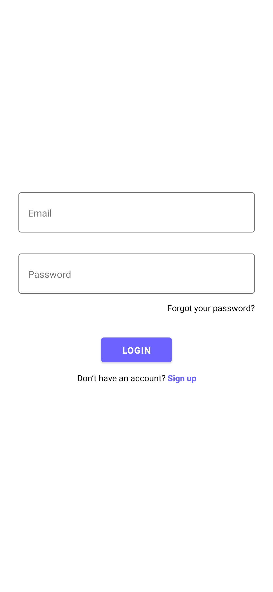
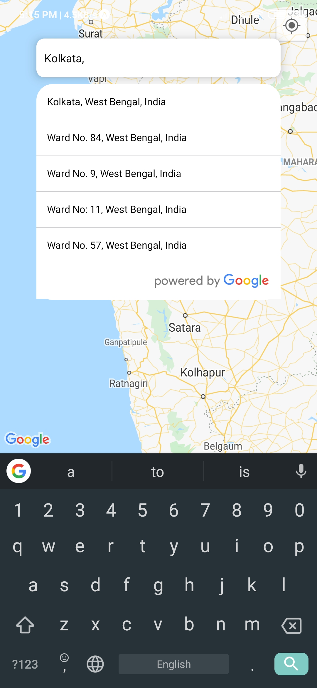
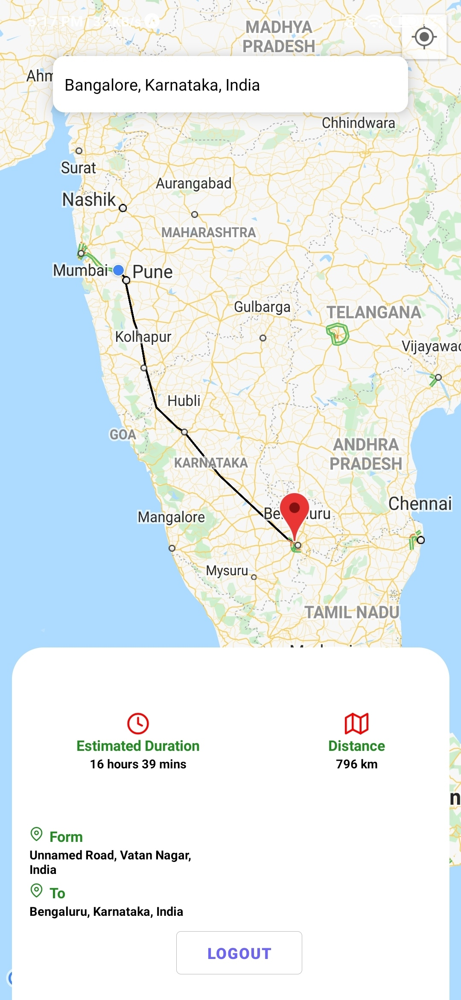
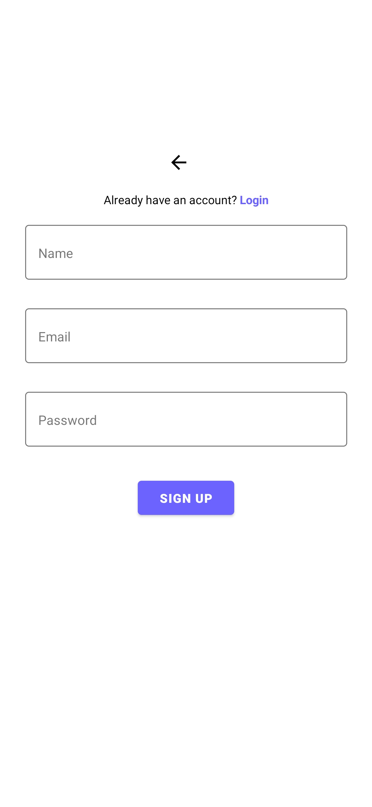
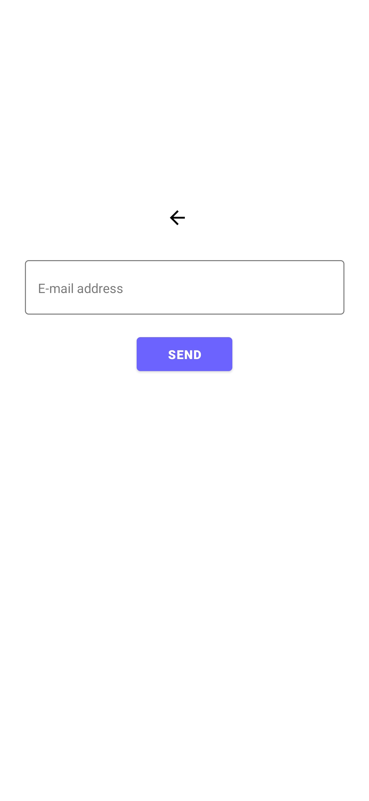
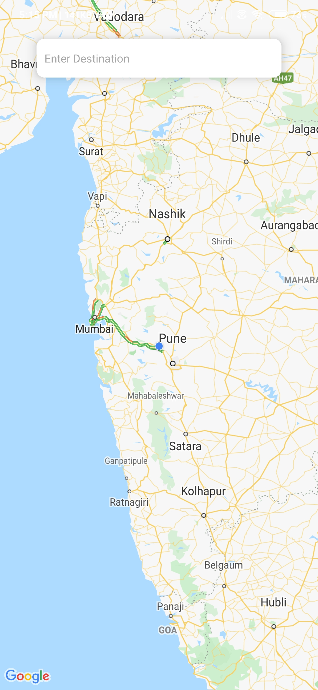

# Login and Google Maps Location


1. Download or clone this repo.
   Note: Install Node v12.9

2. Install dependencies.

```js
npm install
// or
yarn install
```

3. Go to `src/core/config.js` and replace `FIREBASE_CONFIG` with your own firebase config.

```js
export const FIREBASE_CONFIG = {
  apiKey: "xxx-yyy-zzz", // etc.
  // rest of your firebase config
};
```

4. Run project on iOS / Android.

```js
 npm run ios // npm run android
 // or
 yarn ios // yarn android
```
